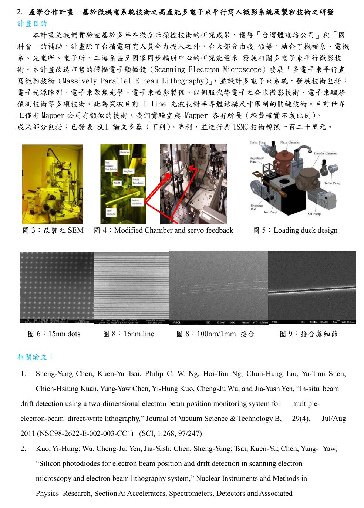

# 半导体电子显微镜高精度的平台的控制

### 这是什么

- 这是我的研究生毕业论文code。目测也是我人生中机械自动化方向的巅峰。
- 虽然将来不会继续从事机械相关（包括自动化控制）行业，但是不可否认系统控制这个方向很有意思。将来应该也会仍然存在在我的生活里，比如说买一个小小的机械手臂玩一玩，弄个自动化赛车或者自做一个小的实体机器人（不是我女朋友2333）什么的。
- 主要是通过c语言来读取测量数据并且建立控制模型运算。另外还有部分matlab用来绘图。想证明哥也是写过c语言的。虽然除了用不到的地方都不会，但是用到的地方也是很有感触。
- 当人老了，应该就会,也只会写c了吧

### 项目背景

### 我的工作

把里面的控制平台拿出来控制，控制走方波走正弦波信号，减少error，以及两个轴的同步。

### 牛逼在哪里

有人说你讲的这个太玄，听不懂。我一开始也没觉得有多厉害。

后来我偶然读到一个文章，讲的是生物体内各个器官的尺寸。我瞬间就对这些数字有所了解了。

这个平台的误差比RNA还要小，可以精准定位到DNA级别的东西。其他的什么细胞细菌甚至病毒在这个平台面前就是庞然大物了（也对，本来电子显微镜就是用来看很小的东西的）。

